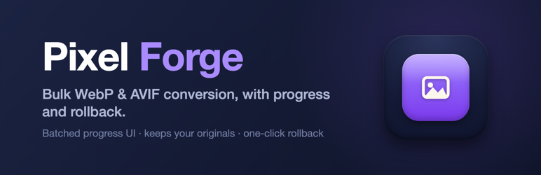
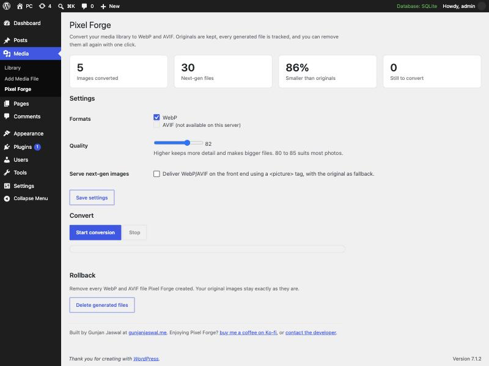

<p align="center">
  
</p>

<h1 align="center">Pixel Forge</h1>

<p align="center">
  <strong>Bulk-convert your media library to WebP and AVIF, with a live progress screen and one-click rollback.</strong><br>
  Smaller images, your originals untouched, and nothing you can't undo.
</p>

<p align="center">
  
  
  
  
  
</p>

<p align="center">
  
  
  
  
  
  <a href="https://ko-fi.com/gunjanjaswal"></a>
</p>

---

<p align="center">
  <a href="#what-it-does">What it does</a> ·
  <a href="#features-at-a-glance">Features</a> ·
  <a href="#how-it-works">How it works</a> ·
  <a href="#the-progress-screen">Progress</a> ·
  <a href="#rollback">Rollback</a> ·
  <a href="#serving-next-gen-images">Serving</a> ·
  <a href="#installation">Install</a> ·
  <a href="#faq">FAQ</a> ·
  <a href="#roadmap">Roadmap</a>
</p>

---

## What it does

WebP and AVIF are the modern image formats. At the same visual quality they are far smaller than the JPEG and PNG files most libraries are full of, which means faster pages and lighter bandwidth bills. The catch is getting your existing library converted without a risky, all-or-nothing batch job.

Pixel Forge does exactly that. It walks through your media library in small batches, writes a WebP and/or AVIF copy of every image next to the original, and shows you a live progress bar the whole time. Your originals are never changed. When you want the generated files gone, one click removes every last one of them.

## Features at a glance

| | Feature | What you get |
| :---: | --- | --- |
| 🖼️ | **WebP + AVIF** | Convert to either format or both, whichever your server can create. |
| 📊 | **Live progress** | Small AJAX batches with a progress bar, running counts, and a log, so big libraries never time out. |
| 🧱 | **Every size** | The full image and every registered thumbnail size are converted. |
| 🔒 | **Originals safe** | New files are written alongside originals. Your JPEGs and PNGs are never modified. |
| ↩ | **One-click rollback** | Delete every generated file in one go. Originals stay exactly as they are. |
| 🎚️ | **Quality control** | Pick the encoder quality that balances size against detail. |
| 🖥️ | **Optional serving** | Deliver next-gen files through a `<picture>` tag with the original as a fallback. |
| 🧩 | **No dependencies** | Uses WordPress' own image engine (GD or Imagick). No libraries, no build step. |

## Why next-gen formats

| Format | Typical saving vs JPEG/PNG | Browser support | Notes |
| --- | --- | --- | --- |
| **WebP** | ~25–35% smaller | Universal (all modern browsers) | Fast to encode. A safe default for everyone. |
| **AVIF** | ~40–55% smaller | All current major browsers | Smaller still, but slower to encode. Great for photo-heavy sites. |

Convert to both and let the browser pick the best one it understands.

## How it works

```
  Media library (JPEG / PNG originals)
            │
            │  processed in small batches over AJAX
            ▼
  Pixel Forge  ──►  WP_Image_Editor (GD / Imagick)  ──►  WebP + AVIF siblings
            │
            ▼
  photo.jpg                      (untouched original)
  photo.jpg.webp                 (new)
  photo.jpg.avif                 (new)
  …and the same for every thumbnail size
```

Each original keeps its place. The new file is written next to it with the format appended to the name, so there is never a collision and the original is always obvious. Every generated path is recorded in the attachment's meta, which is what makes rollback exact: it removes precisely what Pixel Forge created and nothing else.

## The progress screen

Everything happens on one screen at **Media → Pixel Forge**:

- **Status cards** — images converted, next-gen files created, how much smaller they are, and how many are still to go.
- **A progress bar** — conversion runs in small batches (AVIF encoding is CPU-heavy, so small is deliberate), and the bar and counts update after each batch.
- **A live log** — each image as it is processed, with any errors called out.
- **Stop any time** — the run pauses after the current batch. Start again whenever; it picks up where it left off.

## Rollback

Converted everything and changed your mind? The **Rollback** section deletes every WebP and AVIF file Pixel Forge generated, in batches, and clears its tracking. Your original images are never part of that, so there is nothing to restore and nothing to lose.

## Serving next-gen images

Serving is **off until you switch it on**. When it is on, any `` that has a matching next-gen sibling is wrapped in a `<picture>` element:

```html
<picture>
  <source type="image/avif" srcset="photo.jpg.avif">
  <source type="image/webp" srcset="photo.jpg.webp">
  
</picture>
```

The browser downloads the first format it can decode and falls back to the original `` otherwise. If a sibling file does not exist, no `<source>` is added, so a missing file can never break a page. It applies to post content, featured images, and attachment images.

## Screenshot

<p align="center">
  
</p>

## Installation

### From your dashboard

1. Download this repository as a ZIP.
2. **Plugins → Add New → Upload Plugin**, choose the ZIP, install and activate.

### Manually

1. Copy the `pixel-forge` folder into `wp-content/plugins/`.
2. Activate **Pixel Forge**.

Then open **Media → Pixel Forge**.

### Requirements

- WordPress 6.5 or newer (AVIF support landed in 6.5)
- PHP 7.4 or newer
- GD or Imagick with WebP support, and with AVIF support for AVIF

The settings screen detects and shows which formats your server can actually create.

## How to use it

1. Open **Media → Pixel Forge**.
2. Tick the formats you want (WebP, AVIF, or both) and set the quality. **Save settings.**
3. Click **Start conversion** and watch the progress bar.
4. (Optional) Turn on **Serve next-gen images** to deliver them on the front end.
5. Changed your mind? Use **Rollback** to remove every generated file.

## Settings

| Setting | What it controls |
| --- | --- |
| **Formats** | Convert to WebP, AVIF, or both. Unavailable formats are disabled automatically. |
| **Quality** | Encoder quality (1–100). 80–85 suits most photos. |
| **Serve next-gen images** | Whether to output `<picture>` tags on the front end. Off by default. |

## FAQ

**Does it change or delete my originals?**
No. Originals are never modified. New files are written alongside them, and rollback only ever removes those new files.

**Where do the converted files go?**
Next to each original, with the format appended: `image.jpg.webp`, `image.jpg.avif`. The full size and every thumbnail size are converted.

**Will my pages break if a next-gen file is missing?**
No. Serving uses `<picture>` with the original `` as the final fallback, so the browser always has the original to fall back to.

**Why is AVIF slower than WebP?**
AVIF encoding is more CPU-intensive. That is exactly why conversion runs in small batches rather than one long request.

**Does it work with page builders?**
Serving rewrites standard `` tags in content, featured images, and attachment images. Builders that render their own markup for images may bypass that rewrite; the conversion itself still runs for every image either way.

## Roadmap

| Version | Status | Focus |
| --- | :---: | --- |
| **1.0** | ✅ Shipped | Bulk WebP/AVIF conversion, batched progress UI, quality control, `<picture>` serving, one-click rollback |
| **1.1** | 🛠️ Planned | Convert automatically on upload; per-image actions in the Media Library |
| **1.2** | 💡 Exploring | WebP/AVIF for the editor, bulk re-convert at a new quality, size/skip rules |

## Contributing

Issues and pull requests are welcome at [github.com/gunjanjaswal/Pixel-Forge](https://github.com/gunjanjaswal/Pixel-Forge). A sample image and your settings help a lot when reporting a bug.

## Support

Find it useful? You can [buy me a coffee on Ko-fi](https://ko-fi.com/gunjanjaswal).

Bug or idea? Open an issue, or email [hello@gunjanjaswal.me](mailto:hello@gunjanjaswal.me).

## Author

**Gunjan Jaswal**

- Website: [gunjanjaswal.me](https://www.gunjanjaswal.me)
- Email: [hello@gunjanjaswal.me](mailto:hello@gunjanjaswal.me)
- Ko-fi: [ko-fi.com/gunjanjaswal](https://ko-fi.com/gunjanjaswal)

## License

Released under the [GPLv2 or later](https://www.gnu.org/licenses/gpl-2.0.html).
